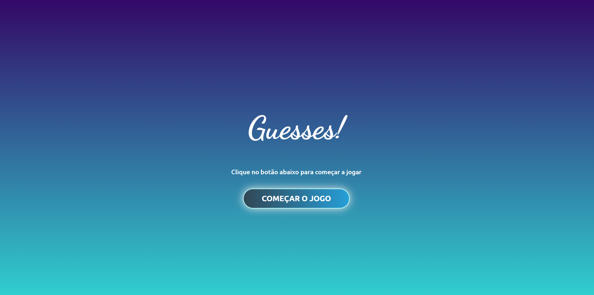

# Jogo palavra secreta - Guesses!

Este projeto foi desenvolvido em ReactJS, através do curso do Professor Matheus Battisti (Hora de Codar). A proposta era a criação de um mini-game onde o usuário deverá acertar uma palavra aleatória, a partir de suas letras (assim como em programas como "Roda a Roda").

Durante o projeto foram aplicados diversos conceitos de ReactJS como por exemplo a utilização e gerenciamento de states, utilização de hooks como useEffect, useCallback, além da componentização de elementos.

Além do que foi proposto no trabalho inicial, realizei algumas alterações de layouts de forma a deixar a experiência mais fluida, alterei a fonte dos textos e inser uma animação para cada palavra acertada.

## Acesse o projeto

https://leandroteixeira97.github.io/secret-word-reactjs/

## Download e instalação do projeto local

Para rodar o projeto em uma máquina local você precisará, primeiramente, do Node instalado em seu computador (https://nodejs.org/en/).Após isto, siga os passos:

### Passo I
Realizar o seguinte comando no bash do git:

`git clone https://github.com/leandroteixeira97/secret-word-reactjs.git`

Isto realizará uma cópia local do repositório em sua máquina.

### Passo II
No diretório do projeto, dê o seguinte comando no bash para instalar todas as dependências necessárias do projeto:

 `npm install`

### Passo III
Ainda no diretório, dê o seguinte comando no bash para rodar o projeto localmente, em modo de desenvolvimento.

`npm start`

### Passo IV
Abra o link [http://localhost:3000](http://localhost:3000) para visualizar o projeto rodando no servidor local.

## Prints

### Tela Inicial

### Tela de Jogo

### Tela de Fim de Jogo

